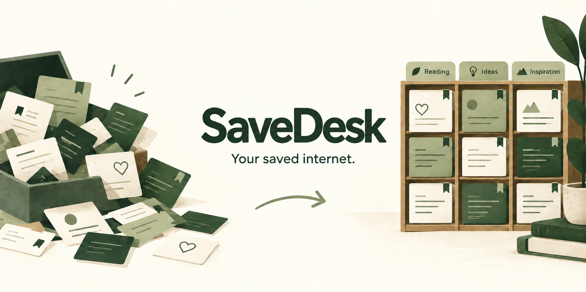

<p align="center">
  
</p>

# SaveDesk

**A calmer home for your X likes and bookmarks.** Search a compact card grid, organize ideas with topics, and work through an unread queue at your own pace.

[Open SaveDesk](https://sharpmeow.github.io/SaveDesk/) · [Get started](docs/GETTING_STARTED.md) · [Connect X](#connect-x) · [Contribute](CONTRIBUTING.md)

[](https://github.com/SharpMeow/SaveDesk/actions/workflows/ci.yml)
[](LICENSE)

## Just want to use it?

**[Open SaveDesk in your browser →](https://sharpmeow.github.io/SaveDesk/)**

No GitHub account, coding, or installation needed. Choose **Get started** on the site: it explains how to request your X archive and add the downloaded ZIP. You can explore the examples while you wait. Your archive is read on your device. Without an account, imports stay in your browser; signed-in account libraries sync extracted saves online.

**[Follow the plain-language getting-started guide](docs/GETTING_STARTED.md).** To share with someone else, download a searchable HTML page from **Backup & share** and send the file. They can open it in a browser.

## What it does

- Import an X archive ZIP, archive likes files, compatible JSON exports, or a SaveDesk backup.
- Search post text, `@authors`, and `#topics`. Filter by author, likes, bookmarks, topics, and reading status. Press ⌘/Ctrl+K to search.
- Merge duplicate posts while preserving their sources, tags, and reviewed status.
- Connect your own X developer app for read-only, manual likes and bookmarks sync.
- Optionally sign in with Google, GitHub, Microsoft, or Apple and sync a private library across devices on a configured site. [Setup instructions](docs/ACCOUNTS.md).
- Copy selected saves with source links for an AI chat. Download a backup or a searchable page to share, with no GitHub required.

The shipped app needs no build or package installation. File mode uses browser storage, with no database, analytics, or external post embeds. Optional account mode uses Supabase Auth and PostgreSQL; imports and edits in an account library sync online. X access tokens stay in the optional Node server, while account sessions use the Supabase browser SDK. [Privacy details](PRIVACY.md).

The layout adapts to phones, tablets, foldable screen widths, and larger windows. [Device coverage and testing notes](docs/TESTING.md) describe what has been checked.

**Status: early prototype.** The demo contains fictional saves. Import and OAuth/API behavior have automated tests, but X login and retrieval have not been validated against a live account. Bring your own developer app and API access to use sync. The public demo has no configured account backend. Provider login still needs live validation on a configured deployment. This project has no promised release schedule.

## Choose how to use it

| Mode | What you need | What works |
| --- | --- | --- |
| [Public demo](https://sharpmeow.github.io/savedesk/) or static hosting | A modern browser | File import, search, tags, reading queue, export |
| Static site with configured Supabase | Your Supabase project and provider setup | File features plus account sign-in and cross-device library sync |
| Local Node.js server | Node.js 22 or 24 LTS recommended | All file features; optional X login with credentials |
| Hosted Node.js server | HTTPS host, your X app, environment secrets | X login and sync on your own deployment |

GitHub Pages cannot run the OAuth server. The demo guides you through file import. X sign-in is shown only when the server is configured.

## Quick start for self-hosting

```sh
git clone https://github.com/SharpMeow/SaveDesk.git
cd SaveDesk
npm start
```

Open **http://localhost:4173**. No `npm install` or credentials are needed for file imports. The code requires Node.js 22+; use a supported LTS version for deployment. Python 3 users can run `npm run start:static` if Node is available, or `python3 -m http.server 4173 --bind 127.0.0.1` directly for static mode.

Choose **Add your saves → Choose a file** to bring in your file. Use **What are you adding?** to choose the source for unlabelled records. [See formats and examples](docs/IMPORTING.md).

## Connect X

1. Create an app in the [X Developer Console](https://developer.x.com/) and enable OAuth 2.0 as a **Web App**.
2. Register the exact local callback URL: `http://localhost:4173/auth/callback`.
3. Copy `.env.example` to `.env` and fill in your OAuth 2.0 Client ID and Client Secret locally.
4. Stop any existing SaveDesk server, then run `node --env-file=.env server.mjs`.
5. Open **http://localhost:4173**, choose **Add your saves → Connect X instead**, authorize, then choose **Sync X saves**.

[Full X setup, permissions, and troubleshooting](docs/X_SETUP.md). Your X account needs access and any required credits for the requested API endpoints. Do not put credentials in GitHub or browser code.

## Publish your collection

Import and organize your saves, choose **Backup & share → Advanced: publish a website → Download website data**, then replace `collection.json` in **your own fork** with that file. Enable GitHub Pages from `main` and `/ (root)`. Reading progress is excluded from the public export.

Publishing makes post text, authors, IDs, and tags public. Do not submit your collection to this upstream repository. Keep full X archives and private exports out of Git history. [Deployment instructions](docs/DEPLOYMENT.md) explain static and server hosting.

## Limits to know

- No guarantee of every historical like or bookmark. X and export files can omit data.
- Text and author retrieval only; no media downloads, deleted-post recovery, full-thread reconstruction, or automatic background sync.
- Each sync handles up to 20 pages per source, with up to 100 records per page. Click again to resume; reloading resets cursors and duplicates are merged.
- OAuth sessions expire within two hours and disappear when the server restarts. Reconnect to continue.
- Browser storage has limits. Export backups regularly; ZIPs above 200 MB and individual JSON/JS files above 50 MB are rejected.
- Post ID ordering approximates post chronology, not when you saved it. Cross-device reading-state sync requires a configured account backend; device-only mode uses backups.

## Documentation

- [Start here: no GitHub experience needed](docs/GETTING_STARTED.md)

- [Import formats and backups](docs/IMPORTING.md)
- [X authentication and troubleshooting](docs/X_SETUP.md)
- [Google, GitHub, Microsoft, Apple, and cloud storage setup](docs/ACCOUNTS.md)
- [Research: GitHub stars, Reddit, TikTok, Instagram, and other sources](docs/SOURCES.md)
- [Deployment](docs/DEPLOYMENT.md)
- [Architecture and development](docs/ARCHITECTURE.md)
- [Privacy and data handling](PRIVACY.md)
- [Security reporting](SECURITY.md)
- [Contributing](CONTRIBUTING.md) and [community guidelines](CODE_OF_CONDUCT.md)
- [Changelog](CHANGELOG.md)

## License and attribution

SaveDesk's code and documentation are [MIT licensed](LICENSE). Imported posts and media remain subject to their respective owners' rights; the software license does not relicense them. SaveDesk is an independent project, not affiliated with or endorsed by X.

The bundled ZIP reader retains its [upstream MIT license](vendor/fflate-LICENSE). The optional Supabase client includes [dependency notices](vendor/SUPABASE-LICENSES.txt) and [rebuild instructions](vendor/README.md).

The README banner is an AI-generated illustration, not a screenshot. [Artwork provenance and prompt](docs/assets/README.md).
