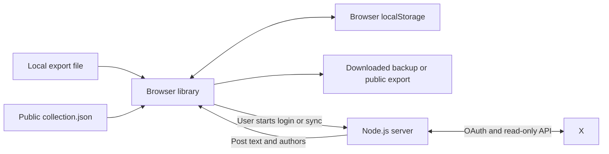

# Architecture

SaveDesk is a small browser application with an optional Node.js OAuth/API server. It has no package installation, build pipeline, or database. The ZIP reader is vendored locally with its license.

## Files

| File | Responsibility |
| --- | --- |
| `index.html`, `style.css` | Layout, styles, onboarding, and dialogs. |
| `import-client.mjs`, `import-worker.mjs` | Import worker lifecycle, deadline, and browser message boundary. |
| `importing.mjs`, `vendor/fflate.mjs` | Local file/ZIP reading with size limits and likes-only selection. |
| `library.mjs` | Author/topic search, selected context, and escaped standalone HTML exports. |
| `app.js` | Browser state, filtering, rendering, local persistence, imports/exports, and sync controls. |
| `model.mjs` | Import normalization and duplicate merging, shared with tests. |
| `server.mjs` | Static file allowlist, OAuth state/session storage, token exchange, and authenticated X reads. |
| `collection.json` | Optional public collection loaded at startup. Empty upstream. |
| `model.test.mjs`, `importing.test.mjs`, `library.test.mjs` | Parser, ZIP selection, size limits, merge, search, and safe export regressions with fictional inputs. |
| `server.test.mjs` | Mocked OAuth/API flows, session behavior, origin checks, and file access boundaries. |

## Data flow



Publishing is separate: the user commits an exported `collection.json` to their own repository. The app does not have GitHub credentials and cannot publish itself.

## Storage and ordering

The browser stores a JSON library under `savedesk-v1`. A fresh browser sees the public collection, or fictional sample records when it is empty. Existing local records merge with the public collection. Reviewed state and tags can survive duplicate imports; this is additive merging, not a deletion/mirror protocol.

IDs remain strings and are compared with `BigInt` for post chronology. The UI renders at most 24 matching records per page, but filters and sorts the in-memory collection. Large libraries are constrained by browser memory and localStorage quota. The 50 MB JSON/JS import limit (200 MB for compressed ZIP input) is not a guarantee that a library of that size will fit in storage.

## Authentication boundary

OAuth uses S256 PKCE with a random, one-use state value and a ten-minute pending-login lifetime. Tokens stay in memory behind opaque HttpOnly session cookies. Sessions expire no later than two hours. Sync/disconnect use POST and require the configured origin. The server does not request offline access or implement refresh tokens.

X responses are normalized to the import model. The browser handles pagination, preserves successful pages, and reports failures. Unit tests use a supplied fetch stub; they do not establish real X compatibility or endpoint entitlement.

## Validation

```sh
npm test
node --check app.js
node --check server.mjs
node --check model.mjs
node --check importing.mjs
node --check import-client.mjs
node --check import-worker.mjs
node --check library.mjs
git diff --check
```

CI runs tests and syntax checks on Node.js 22 and 24. For UI work, use a real browser and fictional files to check import, search, tags, reading state after reload, and narrow layouts. Keep live X tests explicitly separate from fixtures and mocks.

[Adversarial tests and device coverage](TESTING.md) record the browser checks and remaining validation.
